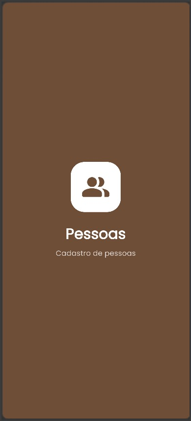
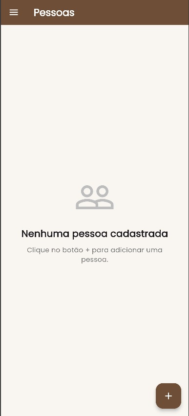
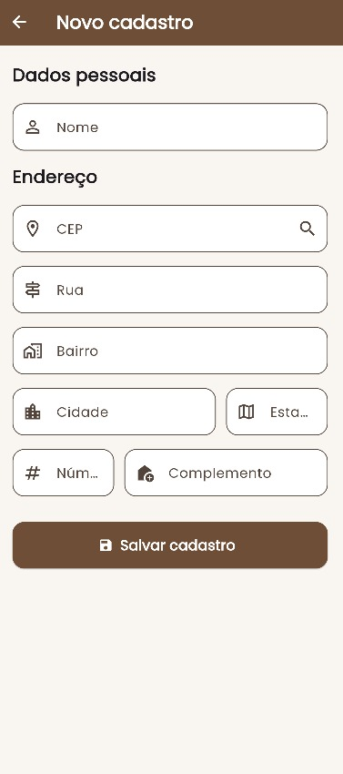
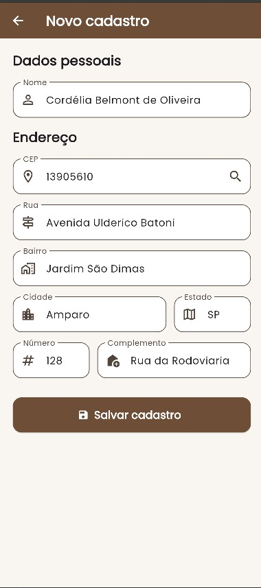
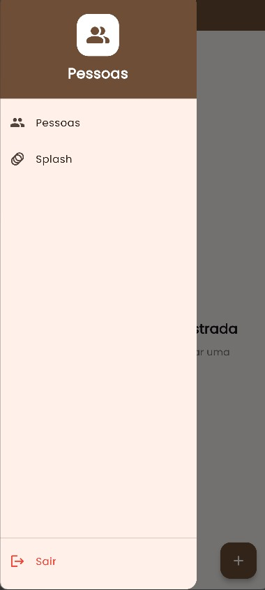

# Cadastro de Pessoas

Aplicativo desenvolvido em Flutter como atividade acadêmica.

O aplicativo permite cadastrar pessoas e consultar automaticamente os dados do endereço através da API ViaCEP.

---

## Funcionalidades

### Splash Screen

* Tela inicial do aplicativo.
* Animação de entrada.
* Redirecionamento automático para a tela principal.
* A Splash também pode ser acessada pelo menu lateral.

### Home

* Cabeçalho do aplicativo.
* Menu lateral.
* Lista de pessoas cadastradas.
* Botão `+` para realizar um novo cadastro.
* Exclusão de pessoas cadastradas.

### Cadastro de pessoas

O aplicativo permite informar:

* Nome
* CEP
* Rua
* Bairro
* Cidade
* Estado
* Número
* Complemento

Ao informar um CEP válido, o aplicativo consulta automaticamente a API ViaCEP e preenche:

* Rua
* Bairro
* Cidade
* Estado

Os dados podem então ser salvos localmente no dispositivo.

### Menu lateral

O menu possui:

* Pessoas
* Splash
* Sair

---

## API utilizada

### ViaCEP

A API ViaCEP foi utilizada para consultar os dados de endereço através do CEP informado pelo usuário.

Documentação:

https://viacep.com.br/

Exemplo de consulta:

```text
https://viacep.com.br/ws/01001000/json/
```

---

## Armazenamento

Os cadastros são armazenados localmente no dispositivo utilizando o pacote:

```text
shared_preferences
```

Dessa forma, os dados continuam disponíveis mesmo depois de fechar e abrir novamente o aplicativo.

---

## Tecnologias utilizadas

* Flutter
* Dart
* ViaCEP API
* HTTP
* Shared Preferences
* Google Fonts

---

## Dependências

```yaml
http
shared_preferences
google_fonts
flutter_launcher_icons
```

---

## Telas

### Splash



### Home



### Cadastro



### Cadastro com endereço preenchido



### Menu lateral



---

## Download do APK

O arquivo APK do aplicativo está disponível abaixo:

[Baixar APK](APK/cadastro_pessoas.apk)

---

## Como executar o projeto

Clone o repositório:

```bash
git clone URL_DO_REPOSITORIO
```

Entre na pasta:

```bash
cd cadastro_pessoas
```

Instale as dependências:

```bash
flutter pub get
```

Execute o aplicativo:

```bash
flutter run
```

---

## Projeto acadêmico

Projeto desenvolvido para a atividade de desenvolvimento mobile.

**Aplicativo:** Cadastro de Pessoas
**Tecnologia:** Flutter
**API:** ViaCEP
